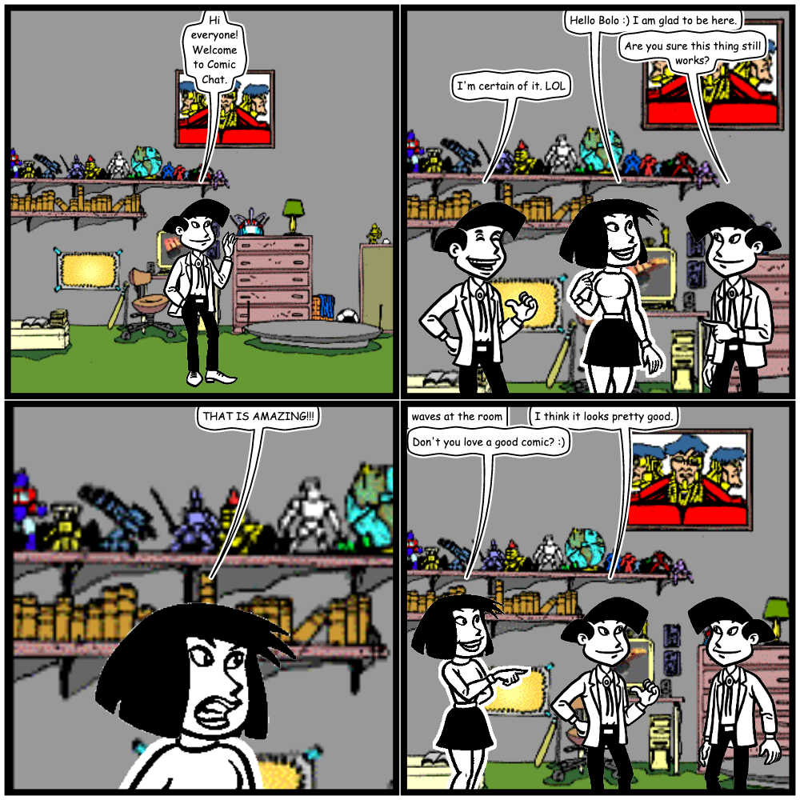

# Comic Chat — modern C# clone

A C# reimplementation of Microsoft Comic Chat, ported from the archived 1996–98 MFC C++ source
in this repository. It follows the original's design and structure rather than reinventing it:
the class names, algorithms, constants and quirks are carried across deliberately, with each
non-obvious piece annotated against the file and line it came from.

It loads the **original `.avb` / `.bgb` art**, so it renders the real Bolo, Anna and Kevin — not
lookalikes.



## Building and running

Needs the .NET 10 SDK. From this directory:

```bash
dotnet build
dotnet test                                    # 445 tests
dotnet run --project src/ComicChat.App          # the app
dotnet run --project src/ComicChat.App -- --render out.png        # headless: script → comic PNG
dotnet run --project src/ComicChat.App -- --verify-history out/   # replay + .ccc round-trip check
```

The art is read straight from `../v2.5-beta-1/comicart` and `../v2.5-beta-1/artpack1`.

## Layout

| Project | Contents |
|---|---|
| `ComicChat.Core` | The engine. No UI dependency at all — it renders headless. |
| `ComicChat.Irc` | IRC client and the Comic Chat wire protocol. |
| `ComicChat.App` | Avalonia UI (cross-platform; developed on macOS). |
| `ComicChat.Tests` | 445 xUnit tests, including tests against the real art files. |

### Core

| Namespace | Ported from | What it does |
|---|---|---|
| `Core.Geometry` | `spline.cpp`, `traj.cpp`, `arc.cpp`, `bbox.h` | Beta/Cardinal splines, trajectories, arcs, `SRect` |
| `Core.Art` | `avbfile.cpp`, `dib.cpp` | `.avb`/`.bgb` reader, zlib DIBs, palettes, mask/aura |
| `Core.Avatars` | `avatar.cpp` | The emotion wheel and pose resolution |
| `Core.Semantics` | `textpose.cpp` + `chat.rc` | The expert system: text → gesture/expression |
| `Core.Comic` | `panel.cpp`, `balloon.cpp`, `backdrop.cpp` | Panel layout, staging, zoom, balloons, tails |
| `Core.History` | `histent.cpp` | The conversation log, replay, and the `.ccc` archive format |

## How it works

Five subsystems, mirroring the original:

1. **Expert system** (`textpose.cpp`) — a stateless keyword/emoticon matcher. Four matcher kinds
   (`AllCaps`, `FindString`, `CheckWord`, `CheckStart`) produce a priority-ranked candidate set on
   an 8-spoke polar emotion wheel. The rules are data, in the original's own
   `Function("arg");Strength` syntax, loaded verbatim from the shipped `chat.rc` strings.

2. **Pose resolution** (`avatar.cpp`) — a priority-ordered constraint fill over independent face
   and torso slots. This is why *"I'm laughing LOL"* gives you a **laughing head on a pointing
   body**: `LAUGH` (priority 11) takes the face, and `POINTSELF` (7) still takes the torso.

   An avatar carries a *current body* between lines (`m_body`), and freezing is what preserves it.
   Dragging the emotion wheel applies a pose and **temporarily** freezes the avatar, so the expert
   system stands down for the next line only (`textpose.cpp:125`); `ResetAvatar` (`avatar.cpp:454`)
   then expires the freeze and returns to neutral, so auto-posing resumes. The "Hold pose" toggle
   is a *permanent* freeze that keeps the pose until you turn it off.

3. **Layout** (`panel.cpp`) — a greedy merge-else-split loop, where the panel is the unit of
   backtracking. Panel count is emergent, not computed. `EvalPair` scores staging (talking to
   someone's back costs 40; facing them rewards adjacency), and a hysteresis pass keeps people
   standing where they stood last panel.

4. **Balloons** (`balloon.cpp`) — outlines are closed beta splines hugging the ragged text block,
   with hand-drawn wobble. Tails provably never cross, enforced by 1-D interval arithmetic over
   "route regions" rather than geometric intersection.

5. **Wire protocol** (`protsupp.cpp`) — gesture data rides on ordinary IRC. Art never crosses the
   wire; only a name and an HTTP URL do. A message from a plain IRC client arrives "uncooked" and
   the receiver runs its *own* expert system over the words — which is why mIRC users still show
   up as expressive characters.

6. **History** (`histent.cpp`) — the comic is a *projection* of the conversation log, never the
   source of truth. Panels are never stored, only the events that produced them. Resizing the
   window changes the panel size, which changes what fits in a balloon, so the strip is thrown
   away and rebuilt by replaying every entry (`ResetExistingPanels` + `ExecuteHistory(HM_RELOAD)`).
   Saving a comic is just writing that log out as `.ccc`, and opening one replays it back through
   the same pipeline a live session uses.

## Deliberate deviations

Everything here is a considered choice, not an accident. Each is commented at the site.

- **No globals.** The original reached for a process-wide client DC for text measurement, the
  CRT's global `rand()`, and static page metrics. These become `ITextMeasurer`, an explicit
  `CrtRandom`, and a `LayoutContext`. That is what lets the engine render headless and be tested.
- **`CrtRandom` reproduces MSVC's `rand()` bit-for-bit.** Not for nostalgia: balloon widths and
  x-placement are drawn from this stream, so `System.Random` would produce a *different* comic
  for the same seed. Panels are seeded from a master stream (`m_seed = rand()`), because seeding
  from a counter makes every panel's first draw tiny — and that first draw picks the balloon width.
- **Parser bugs not reproduced.** `textpose.cpp:196` has an infinite loop on a non-digit strength,
  and unbounded `strcpy` into fixed buffers. The port is safe and documented.
- **`CheckStart` is switchable.** The original passed the whole message rather than the
  per-sentence pointer to `StartCompare2`, so only the first sentence was ever tested — "No. Hi
  there" never waved. The dead `lptr` proves the intent, so `SentenceScope.EverySentence` (the
  default) does what was meant; `SentenceScope.FirstSentenceOnly` reproduces the shipped bug
  exactly. Both are tested.
- **AVB "ditto" rule adjusts before comparing.** The original compares a raw offset against an
  already-adjusted one, so wherever an `AK_OFFSET_ADJUSTMENT` is in force every ditto misses and
  duplicate poses are built. Harmless but wasteful; the port does the intended thing.
- **The rendering `&=` bug *is* reproduced** — Comic Chat's art depends on it.
- `Disconnect()` sends `QUIT`; the original never did. Opt out with `sendQuit: false`.
- Message splitting omits the DBCS and rich-formatting-run handling; the length budget is faithful.

## Findings from the port

Things the original source disagreed with its own comments or docs about:

- **Torso/body records are 25 bytes, not 29** as the struct layout implies. Verified against the
  bytes in `bolo.avb`.
- **`ANGRY`, `SCARED` and `BORED` are unreachable from text.** Their rulesets in `chat.rc` are
  literally `""`. They can only be picked by hand on the emotion wheel.
- **`normHeight` is a constant 100** for every character — "we're assuming characters are the same
  height". Everyone ends up the same height regardless of their art.
- **Annotations are visible to plain IRC clients.** There is no cleverness: a mIRC user sees
  `(#G3<9E0:5RM1) hello`. The parenthesisation is cosmetic; IRCX's out-of-band `DATA` was the fix.
- **`autopage.cpp` is not the page layout engine** (it's the automation dialog), and **`rules.cpp`
  is not the gesture rules** (it's IRC moderation scripting). `semantic.cpp` is entirely `#if 0`.
- **`cache.cpp` does not compile** — it was dead code excluded from the build.
- **The `.ccc` format and the wire format have diverged**, despite the comment at `histent.cpp:162`
  claiming the archive code was "borrowed almost exactly from irc.cpp". The archive writes plain
  decimal and gives `R` a value; the wire biases every field by `'0'` and treats `R` as a
  presence-only flag. They need separate types.
- **`StartHistoryEntry` captures a random seed it never writes** (`histent.cpp:531` serialises only
  name, avatar and title), so a reloaded archive re-randomises its panels rather than restoring
  the original strip byte-for-byte.
- **`m_bbReq` is hardcoded to 1** when building a `SayEntry` — "for now, ignore req parameter"
  (`histent.cpp:56`) — so every archived line claims the pose was hand-picked.
